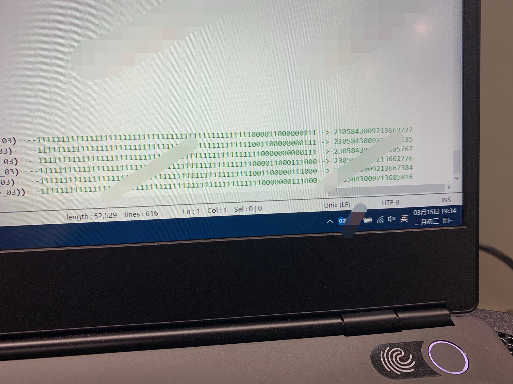
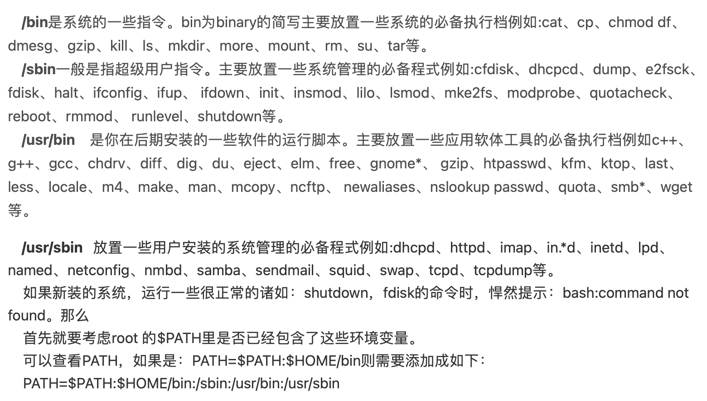
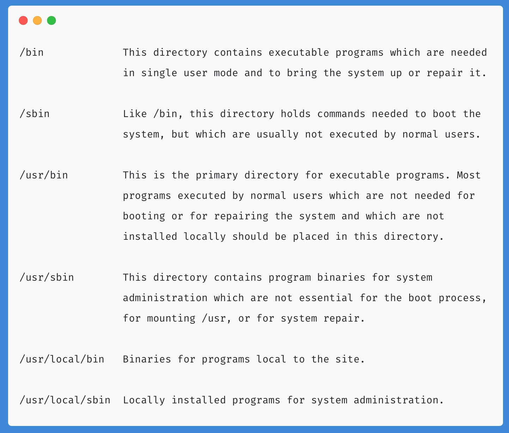
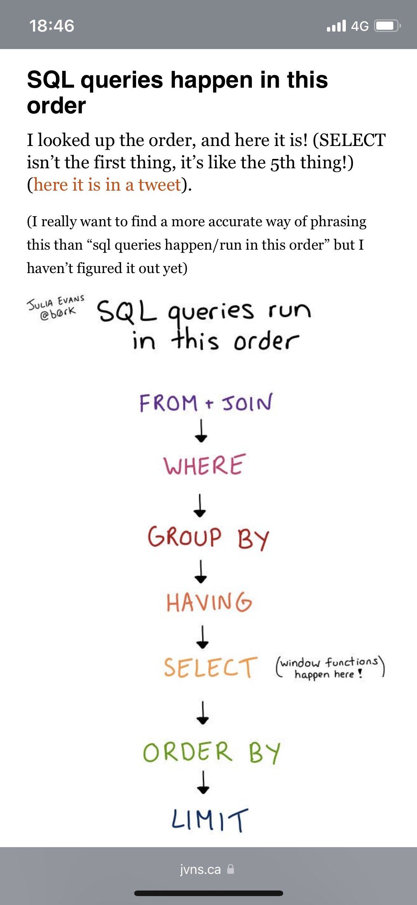
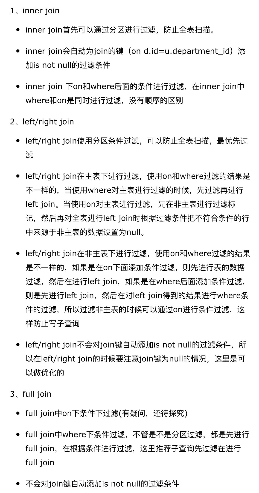
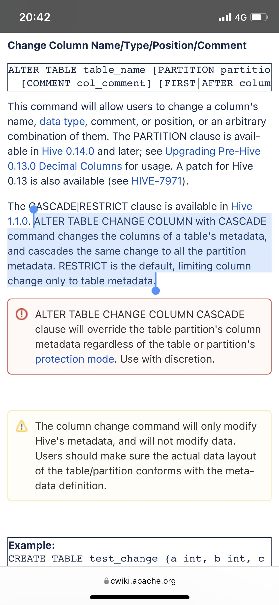
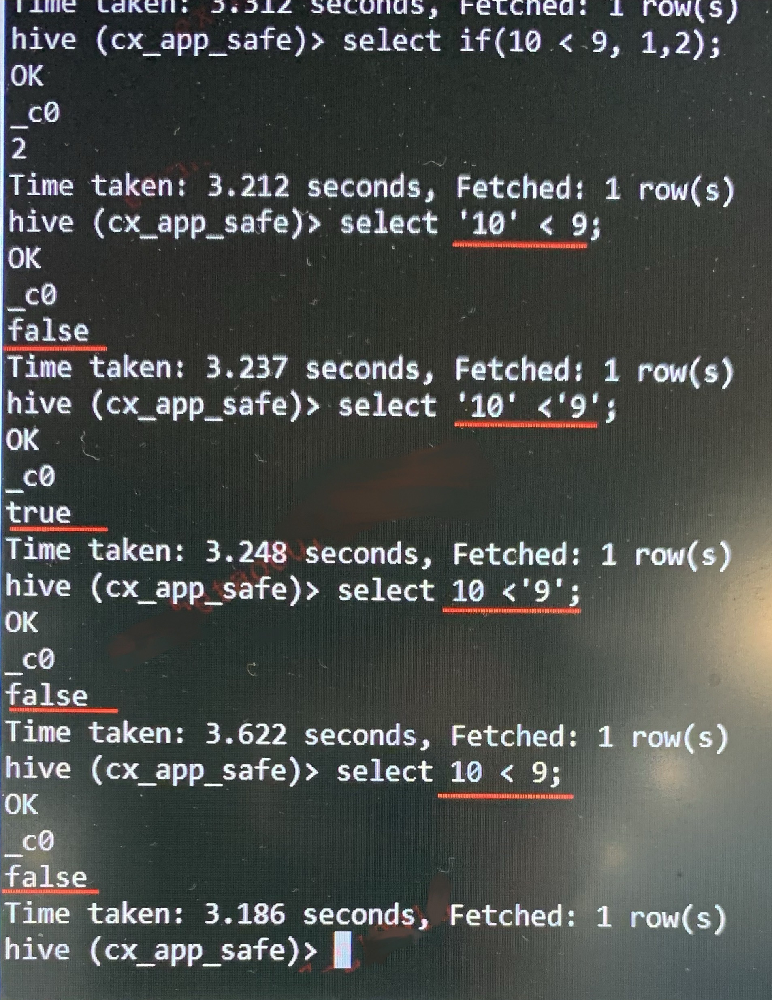
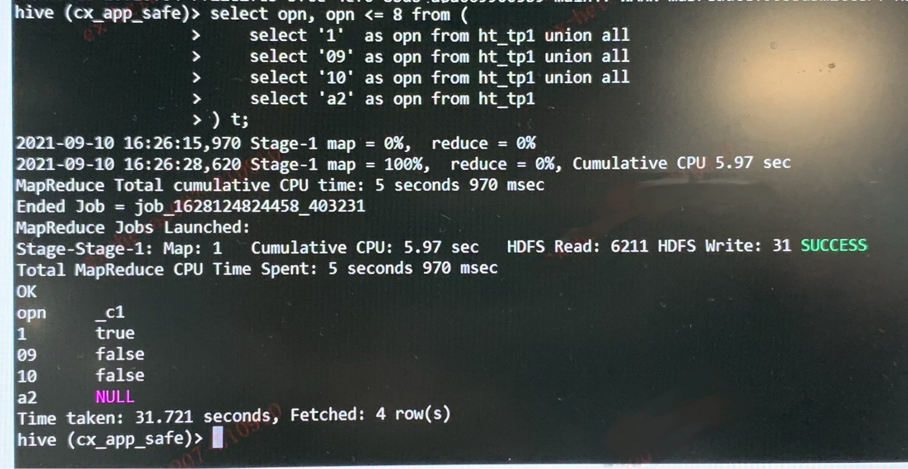
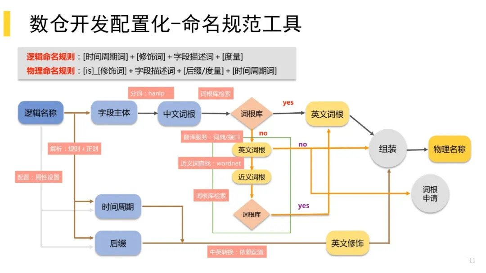

##Twitter 备份

2021-03-15 19:43 

优化了之前写的一段代码，从2100行减少到了350行，生成grouping__id的时候发现60多个字段产生了一个61位的二进制数，转成十进制也有19位!这可能是目前接触到的最大的数字了。结果这个数超上限了，跑了几遍都没有数据，最后打印出来一看，-1

	


2021-03-16 21:59 

今天遇到了一个问题，生成的表文件过大，要求将文件切分成每个1G，设置reducer大小为850M后，总共4.2G的文件却被切分成了80多个，查资料翻到了这篇文章，讲的很详细，如何控制hive插入数据之后生成的文件大小及数量 https://t.co/GlmdR7ITS3

```sql
set hive.merge.mapredfiles=true;
set hive.merge.size.per.task=996147200;
set hive.merge.smallfiles.avgsize=104857600;
set hive.exec.reducers.bytes.per.reducer=996147200;

select * from table distibute by rand();

--以上设置就可以将插入结果表的文件以950M每个的大小平均分割
```


2021-03-22 13:58  

到今天这问题终于解决了，字段数太多导致grouping__id超上限，那就减少字段数，先将其中五十个字段concat_ws拼到一起，grouping完了以后再split切开，字段拼合本身是对group by没有影响的，但是由于部分字段null值较多又引发了数据倾斜的问题，手动将reducer数量设为500就ok了。这个任务优化完发现时效完全没有变化，仿佛什么都没做，不过代码简洁了很多，扩展性和维护性都有很大提升，而且数据量从6亿增加到了10亿，这样的话时效不变也算是性能有提升吧。


2021-03-28 18:09

hive子查询输出的结果中，不能有两个显示的类型和值都相同的字段。比如null as c1,null as c2，或者’2020-01-01’ as c1, ’2020-01-01’ as c2，否则会报错 invalid column reference ‘c2’，指的是后一个字段找不到，其中null识别为void类型，具体为什么会报错可能得读源码才能找到原因了。发现这个问题是因为在执行explain的时候，上游表新增了两个字段，但是表结构未变更。为了方便测试直接将代码修改为null as 字段1，null as 字段2，然后就一直报找不到字段，排查一下午最后发现可能是个bug，改完表结构直接测就ok了，以前可能只有一个字段需要null as，就没出现过这问题。


2021-05-31 16:19

一个本来很小的问题因为两次失误引起了大麻烦，原来的代码是sort by reduce_type desc，第一次修改后是sort by reduce_type desc updated_date desc，没有测试就上线了。结果生产报错，周末加班来提单修复，第二次修改后是 sort by reduce_type，updated_date desc这次测试通过了，于是提交了修复。修复之后今天来了发现数据不对了，原来是sort by reduce_type desc降序，改完变成升序了，降序只对后面的时间生效，所以正确的应该是sort by reduce_type desc，updated_date desc，才是取两次降序的结果。本不应该发生的粗心错误，时时都应保持谨慎认真的态度。


2021-06-18 17:19

有个计算工作日的需求，作为一个计算指标的分母，算当天和当年的实际工作日数（排除周六周日和法定节假日，加上法定调休），开始想着要写个UDF，在网上搜索了半天都没有好的方案，很多写的非常冗长，想自己写发现Java快忘光了，所以又想能不能用shell写，又发现在hive -e命令之后是没法执行shell命令的。有个计算工作日的需求，作为一个计算指标的分母，算当天和当年的实际工作日数（排除周六周日和法定节假日，加上法定调休），开始想着要写个UDF，在网上搜索了半天都没有好的方案，很多写的非常冗长，想自己写发现Java快忘光了，所以又想能不能用shell写，又发现在hive -e命令之后是没法执行shell命令的。后面两个int分别是月和年的值，一年更新一次并不算麻烦，而且法定节假日本来就会变更，需要到年底才知道下一年的安排，公司服务器又不允许连外网，合计下来还不如手动算一下。有时候问题的答案并不是多么高深多么新颖的技术，在结果导向的工作环境下，能简单快速有效地解决问题的才是最好的方法。


2021-06-25 23:20

/bin,/sbin,/usr/bin,/usr/sbin的区别，记录一下，这个解释很详细	

another version, including /usr/local directories

	


2021-07-10 18:50

	


2021-07-21 00:53

Hive各种关联情景下过滤条件的处理

	


2021-08-12 19:57

hive query problem about mismatch data type when using presto。在网上找了好久都没有找到答案，中英文都搜索过，甚至在presto的官方GitHub上好几个issue里都被视作是正常的而没有最终解决。错误原因是对于分区表而言，用Alter table语句来修改表结构（某些字段的类型从bigint改为decimal）只会改变整表的schema，不会影响已经存在数据的分区的schema，而presto所使用的SQL是一个强类型语言，当他检测到整表的schema与分区字段的schema不一致的时候就会报错，mismatch data type。如果没有找到我接下来要说的答案，就只能删表重建然后重跑数据了，对于已经存在几百个分区的大表而言实在太浪费资源及时间。最后我在hive的官方文档里找到了这个东西，原来Alter table有个cascade的参数，可以在修改字段类型的时候一并修改已经存在的分区的字段类型，默认这个参数是restrict，即不修改分区的字段类型，这也是因为hive能自动（隐式）转换字段类型，所以hive是支持表结构和分区字段类型不同的，而且Alter table里面还有个参数可以指定特定的分区，更是因为这一点，才能主动只修改部分分区的schema。最后我让运维加上cascade关键字重新执行一下（跑了大概半小时），最后还得重启一下presto引擎，才最终修复OK。

	

这里面还有两个小插曲，一个是我一开始让运维执行的时候给的是之前已经跑过一遍的语句，只是末尾加上了cascade，结果报错了，no renamed column detected，估计是没有检测到有任何列修改，就不给执行了。所以我在每个字段的comment里加了两个字，再去执行一下就OK了，开始自动一个分区一个分区的修改。第二个是在执行过程中我为了能快点看到结果，不断的用hive执行desc，发现字段注释确实是一行行的修改的，但是我用presto执行desc却只能查看到分区字段，而且用presto select *也只能看到分区字段这一列，说明在修改partition的schema的过程中，presto已经完全读不到了，直接认为分区的元数据已经丢失。


2021-09-10 16:51

Hive中的隐式转换中，是bigint转换为string，一般不会反过来，但是在测试中发现，<和>号比较的时候，如果有一方为bigint，则默认都按bigint比较，只有两方都为string才按string比较，无论是显式的指定数值(图一)还是通过字段来预处理，都是这样。如果有一方无法强制转换为bigint，则结果直接给空(图二)

		

仔细想了下这么理解似乎不对，string和bigint都能隐式转换为double，那么比较多时候很可能都转换为能够隐式转换的最简单的数据类型（对于这俩而言就是double），这样非数字类型的字符串强转就是空。这样也能解释为什么 ‘1’+8结果是9.0而不是9。


2021-12-08 10:59

有个shell的问题卡了好久终于解决了。时间参数一直无法传入，今天发现时间参数脚本的输出，在另外的地方是被当作入参传入的，而这次的脚本没有给入参，所以无法获取到，source一下时间参数脚本输出的临时文件就ok了。


2021-12-31 16:21

终于找到正则表达式匹配不包含的用法了，^((?!abc).)*$\n  匹配不包含abc的整行，在日志中去除无用信息的时候很方便。


2022-01-11 14:33
