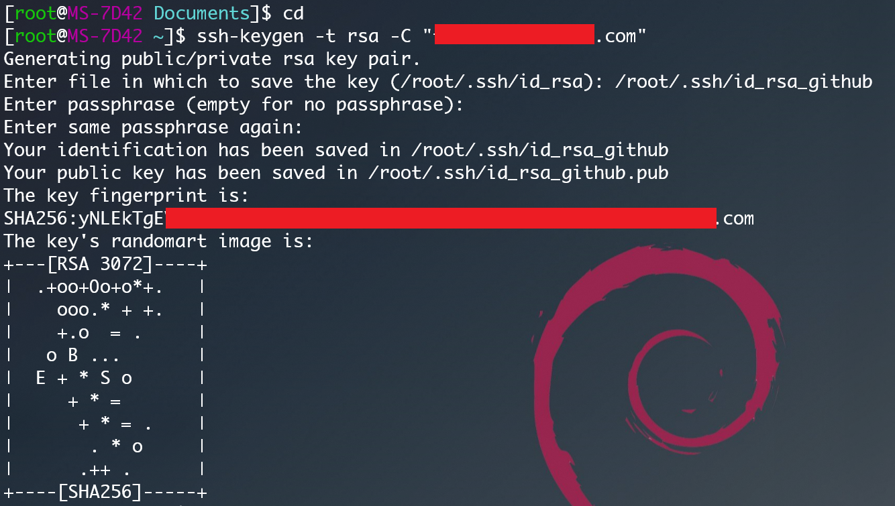
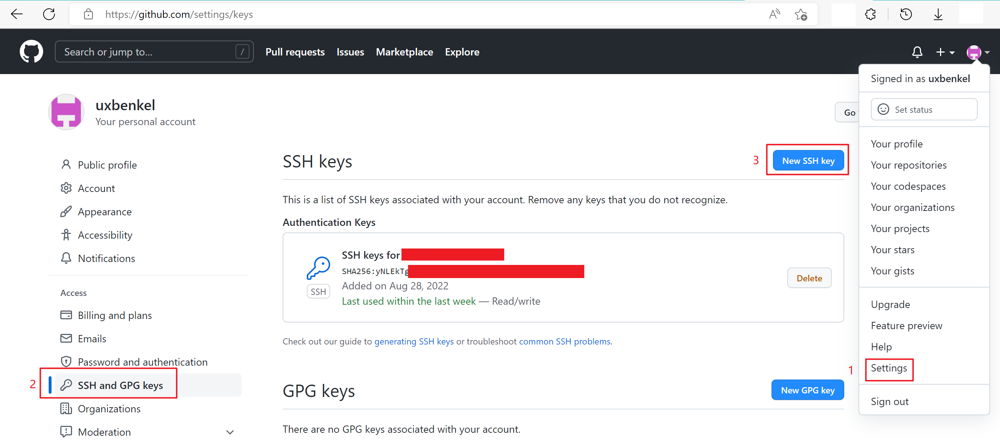
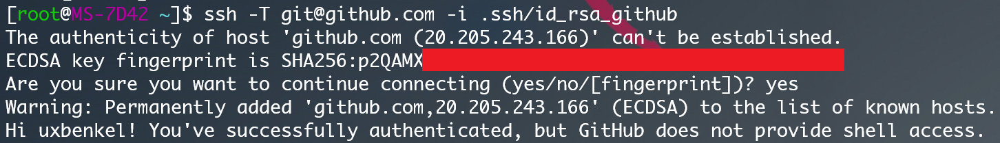
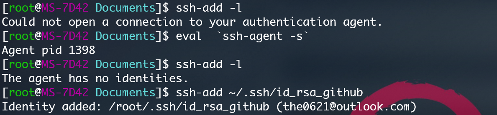

## 配置 Github 和 Git

#### 1.使用Git Bash生成新的ssh key

```bash
cd ~  #保证当前路径在”~”下

ssh-keygen -t rsa -C "uxbenkel@uxbenkel.com"  #建议填写自己真实有效的邮箱地址

# Generating public/private rsa key pair.
# Enter file in which to save the key (/root/.ssh/id_rsa):   #填写带有Github标识的路径
/root/.ssh/id_rsa_github

# Enter passphrase (empty for no passphrase):   
输入密码（留空 直接回车）
# Enter same passphrase again:   
再次确认密码（留空 直接回车）
```



#### 2.将生成的 id_rsa_github.pub 的内容填入 Github 网页 

网页路径如下 Me -> Settings -> SSH and GPG keys -> New SSH key



#### 3.验证是否能连通 

```bash
ssh -T git@github.com -i .ssh/id_rsa_github # -i 用于指定私钥 因为我们使用了自定义的私钥文件名称
```



将本地的私钥 ssh-key 添加到 ssh-agent 

```bash
# 首先执行以下命令开启 agent
eval `ssh-agent -s`

# 查看目前已添加的 key
ssh-add -l

# 添加 刚刚生成的 key
ssh-add ~/.ssh/id_rsa_github
```



#####Windows(PowerShell) 版本

```powershell
# By default the ssh-agent service is disabled. Allow it to be manually started for the next step to work.
# Make sure you're running as an Administrator.
Get-Service ssh-agent | Set-Service -StartupType Manual

# Start the service
Start-Service ssh-agent

# This should return a status of Running
Get-Service ssh-agent

# Now load your key files into ssh-agent
ssh-add .ssh\id_rsa_github
```


#### 4.开始配置本地 Git 账户

```bash
vim ~/.gitconfig #打开 git 配置文件 填入以下内容

[user]
    name = uxbenkel
    email = uxbenkel@uxbenkel.com
[color] # git status 着色
	ui = true
	status = auto
	diff = auto
	branch = auto
	interactive = auto
[core]
	quotepath = false # 解决 git status 中文显示不正常的问题
[pull]
	rebase = false # 设置 pull 默认策略为合并

vim ~/.ssh/config #打开 ssh 配置文件 填入以下内容

Host Github
    User uxbenkel
    HostName github.com
    IdentityFile ~/.ssh/id_rsa_github
    IdentitiesOnly yes
```

#### 5.克隆远程仓库 测试是否配置完成

```bash
git clone git@github.com:uxbenkel/Notebooks.git
```

